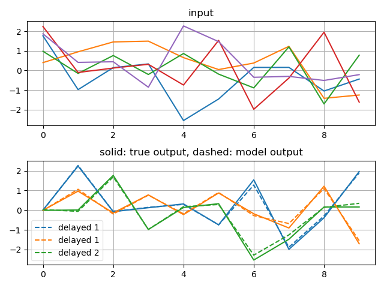
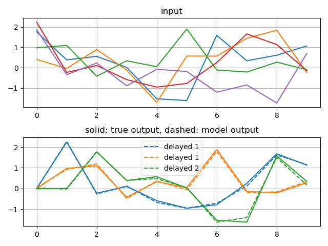

# Demonstration of Recurrent Neural Network in Theano

## Dependencies

* [Theano](http://deeplearning.net/software/theano/)
* [Scikit-learn](http://scikit-learn.org/stable/)
This relies on scikits-learn simply because I subclass their BaseEstimator
class, but this dependency could easily be removed.
* If you want to use the Hessian-Free optimizer then you will also need:
[theano-hf](https://github.com/boulanni/theano-hf)

## Description

* rnn.py : this is the most basic implementation of a "vanilla" RNN. It
is designed for readability. It processes each sequence at a time.
There are three test functions which show how to train an RNN with
real-valued, binary or softmax outputs using stochastic gradient
descent.
* rnn_minibatch.py : this is similar to rnn.py but it is slightly more
complicated code and processes multiple sequences at once for speed
(i.e. in "mini-batches"). It also hooks into scipy.optimize to use
more sophisticated optimization methods. It again includes three test
functions based on output type.
* hf_example.py: this uses the class defined by rnn.py but instead of
training it with stochastic gradient descent, it trains it with
[Martens and Sutskever's variant of Hessian-Free optimization](http://www.cs.toronto.edu/~jmartens/docs/RNN_HF.pdf).

## Figures

## Other implementations

There are other Theano rnn implementations publicly available, for example:
* [Razvan Pascanu's implementation](https://github.com/pascanur/trainingRNNs).
* Razvan also provides a [simple sketch](http://groups.google.com/group/theano-users/browse_thread/thread/39c755b93675f437). This was the starting point for this code on the Theano-users list. 
* [Matthias Zoehrer's implementation](https://github.com/mzoehr/Theano/tree/rnn_benchmark/benchmark/rnn).
